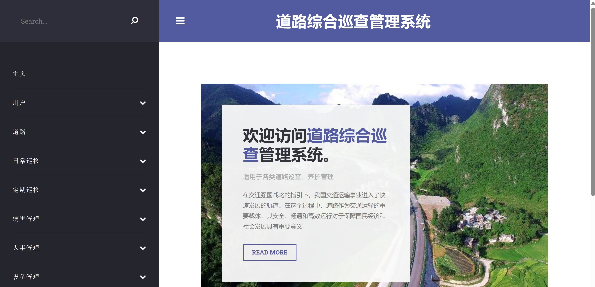
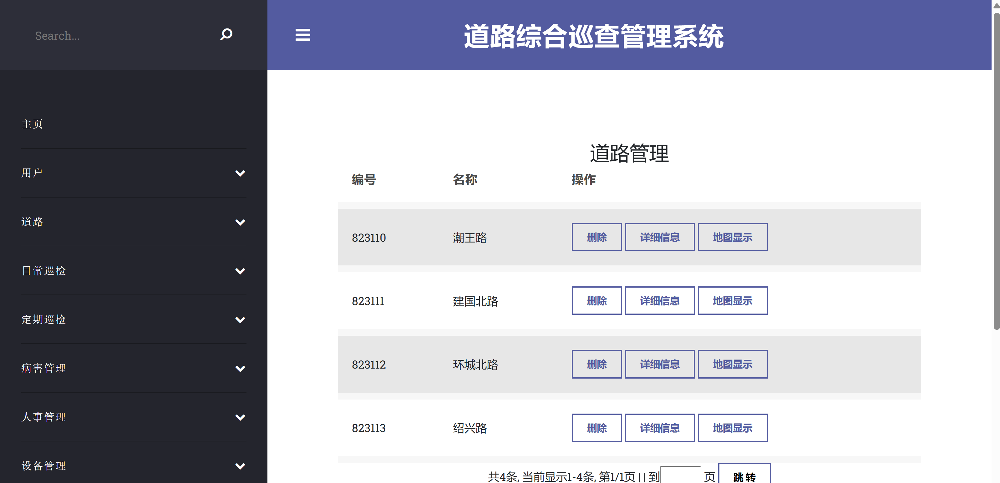
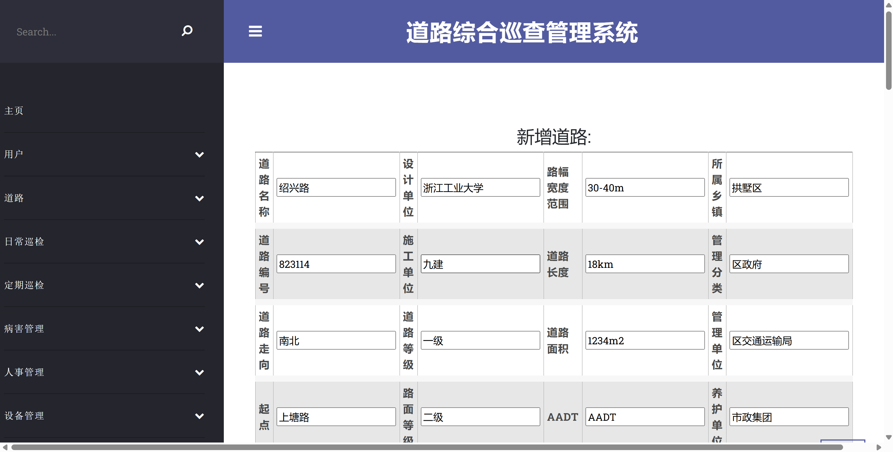
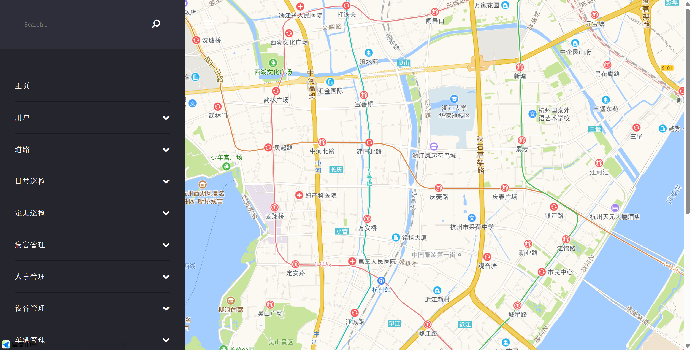
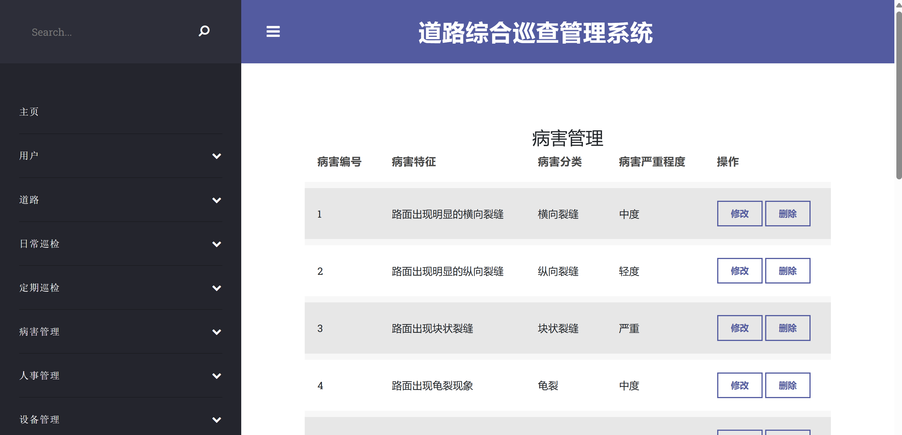

# Comprehensive Road Inspection Management System

Course Design for Introduction to Software Engineering in Zhejiang University of Technology

### Project Team:

- Leader: Boyang Tong
- Team Members: Zhixia Lin, Zongbao Zhang, Tianci Wang, Na Li
- Advisor: Ting Wang

### Technologies Used:

- SpringBoot
- Universal Mapper and Mybatis
- Thymeleaf
- Bootstrap
- Mysql
- Gradle

* log4j2 and Druid Connection Pool

### Usage Instructions

#### IntelliJ IDEA (or other IDEs)

1. Import `init.sql` into your database.
2. Import the project into **IntelliJ IDEA**, then use Gradle to import the required JAR files.
3. Modify the database connection settings and user authentication in the file `*/rmms/src/main/resources/application.yml`.
4. Run the main function `App.java`. Finally, open your browser and navigate to `http://localhost:8090/rmms` to access the system.
5. Default login username: `100101`,password: `123456`, you can find user information in the `assets/rmmsDB(0105).sql` file,`users` table.

### Preview

#### Login Page

#### Home Page

#### User Page

#### Road Page

#### Road Disease Page

### Project Description Document

- Chinese docx version: [项目设计文档](assets/project_description_document/chinese_version_original/智能道路综合巡查管理系统文档.docx)
- Chinese pdf version: [项目设计文档](assets/project_description_document/chinese_version_original/智能道路综合巡查管理系统文档.pdf)
- English markdown version: [Project Description Document](assets/project_description_document/english_version/IntelligentRoadPatrolManagementSystem.md)

**Note:**  
The English version is a translation of the original Chinese document and may not be as detailed.  
It is highly recommended to refer to the Chinese version for a more comprehensive understanding of the project.
Maybe downloading the pdf to view in local is better than viewing in web.

*I spent a lot of time on drawing the UML diagram(take a look!), which is the most important part in this course design program.*

---

# 道路综合巡查管理系统
软件工程导论的课程设计

### 项目团队：

- 负责人：童博扬
- 团队成员：林之夏、张宗宝、王天赐、李娜
- 指导老师：王婷

#### 

### 项目所用技术:

- SpringBoot
- 通用 Mapper 和 Mybatis
- Thymeleaf
- Bootstrap
- Mysql
- Gradle

* log4j2 和 Druid 连接池

###  使用方法

#### IntelliJ IDEA（或其他编译工具）

1. 将init.sql导入数据库中。
2. 将项目导入到 **IntelliJ IDEA** 中，然后利用 gradle 版本控制工具导入 jar。
3. 修改项目中 */rmms/src/main/resources/application.yml 的数据库连接名及用户验证。
4. 启动主函数 App.java 即可。最后打开浏览器，输入 `http://localhost:8090/rmms` 访问系统。
5. 默认登录用户名：`100101`,密码：`123456`, 用户信息在 `assets/rmmsDB(0105).sql` 文件中，`users` 表中。
